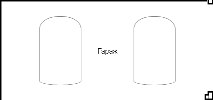

# Задание
[`Видео объяснение (примерно с 36:30)`](https://zoom.us/rec/share/_ZEWiH-xwVPIctZJhZi88khk443hcgeubcAWBs_aXR_fFj4JecIY_kogzhQzy6c6.tJS0zu5HNiHoMF8H?startTime=1609765191000).   
Сверстать страницу макисмально идентичную изображению:  
Задание НЕ творческое: ваша страница должна строго соответствовать картинке и описанному ниже поведению. Исключение: допускается использовать собственные цвета.  
Задание относительно сложное, но все необходимые свойства CSS мы прошли. Я разбил задачу на 3 шага. Первые два шага я надеюсь выполнят все. Третий шаг - со звездочкой - не страшно, если не получится.  
Страница будет представлять собой проект дома. Вид сверху.

## Подготовка
1. Вы можете подключить файл [`theme.css`](./theme.css), чтобы не замораичваться на счет цветов. Учтите, что вам придется дать соответствующие классы элементам-комнатам на вашей странице.
2. Для шага 3 вам потребуется подключить на страницу файл [`measure.js`](./measure.js).

## 1. Шаг 1 - Площади
  
Первым шагом расположите все "комнаты" и пространства как на рисунке. Добейтесь правильных пропорций и поведения при изменении размеров окна. 
1. Дом целиком отстоит от границ окна со всех сторон на одинковое расстояние `4%`
2. `Центальная часть` дома не расширяется больше `280px`, но может при необходимости сжиматься.
3. `Восточное крыло` и `терраса` расширяются и находятся в отношении `3:2`
4. `Гостиная` не расширяется больше `500px` и имеет скругление верхнего правого угла `80px`
5. `Гараж` и `прихожая` имееют одинаковую жесткую высоту `200px`
6. `Холл` и `подсобные помещения` расширяются по высоте и находятся в отношении `4:3`
7. `Кладовая` и `ванная` находятся в отношении `3.5:6.5`
8. `Западное крыло` отстоит от краев `террасы` на `30%`.
9. `Кухня` и `столовая` находятся в отношении `2:3` по высоте. `Кухня` по ширине занимает `75%` `столовой`
10. Надписи расположены строго поцентру комнат.  

См. видео, чтобы увидеть как ведут себя "комнаты" при изменении размеров окна.  
В этом шаге вам понадобится различные комбинации `flex` свойств. Внимательно рассмотрите картинку и определите, что во что вложено, где строки, где столбцы.

## 2. Шаг 2 - Границы
  
Вторым шагом добавим "стены" и "колонны".
1. Все границы и колонны толщиной ровно `10px`.
2. По краю терассы через `равные` промежутки расположено `6` колонн.
3. Если не получится сделсть колонну в левом нижнем углу `гаража` "уголком" как на картинке, можно сделать ее квадратной.
4. Обратите внимание, что `холл`, `гостиная`, `гараж` и `прихожая` идеально встречаются углами в одной точке. Внутренний размер `гаража` остается `200px`

"Стены" можно сделать несколькими разными способами. В любом случае помните, что мы можем указывать значения `border`,  `padding` и `margin` отдельно для каждой из сторон. Колонны в `гараже` можно сделать спомощью абсолютного позиционирования или `flex` контейнеров.

## 3. Шаг 3А - Машины в гараже *
  
1. В `гараже` может быть от 1 до 4 машин в зависимости от его ширины.
2. Одно парковочное место строго `145px` по ширине. Машина - `85x140px`.
3. Контур машины нужно создать на глаз используя `border-radius`. 

## 4. Шаг 3Б - Размеры комнат *

1. Каждая "комната", `гараж` и `терраса` при наведении на них курсора должны отображать свой размер.
2. Всем элементам которые нужно измерять добавьте класс `measurable`.
3. Добавьте в каждый измеряемый элемент `div` с классом `size-x`. С помощью абсолютного позиционирования прижмите его к верхней границе и по центру горизонтально. Доюавьте css `transform: translate(-50%, 0);`, чтобы довершить центрирование.
4. Добавьте в каждый измеряемый элемент `div` с классом `size-y`. С помощью абсолютного позиционирования прижмите его к левой границе и по центру вертикльно. Доюавьте css `transform-origin: top left; transform: rotateZ(-90deg) translate(-50%, 0);`, чтобы довершить центрирование и развернуть надпись.
5. Настройте элементы `size-x`, `size-y` так, чтобы они отображались только при наведении на соответсвующую комнату.
6. Подключите скрипт [`measure.js`](./measure.js). (``). Если все классы даны верно, то скрипт будет подставлять текущие размеры комнат в пикселях.

## 5. Шаг 3В - Двойные границы ***
 
1. Внешня граница дома и коллонн `3px`, внутренняя граница комнат `1px`, расстояние между границами `6px`. 
2. Обратите внимание, что `холл`, `гостиная`, `гараж` и `прихожая` прододжают создвать идеальный крест. Внутренний размер`гаража` остается `200px`
*** Задача сложная. Не переживайте, если не удастся ее сделать. Помните, что элементы могут накладываться и частично скрывать друг друга.