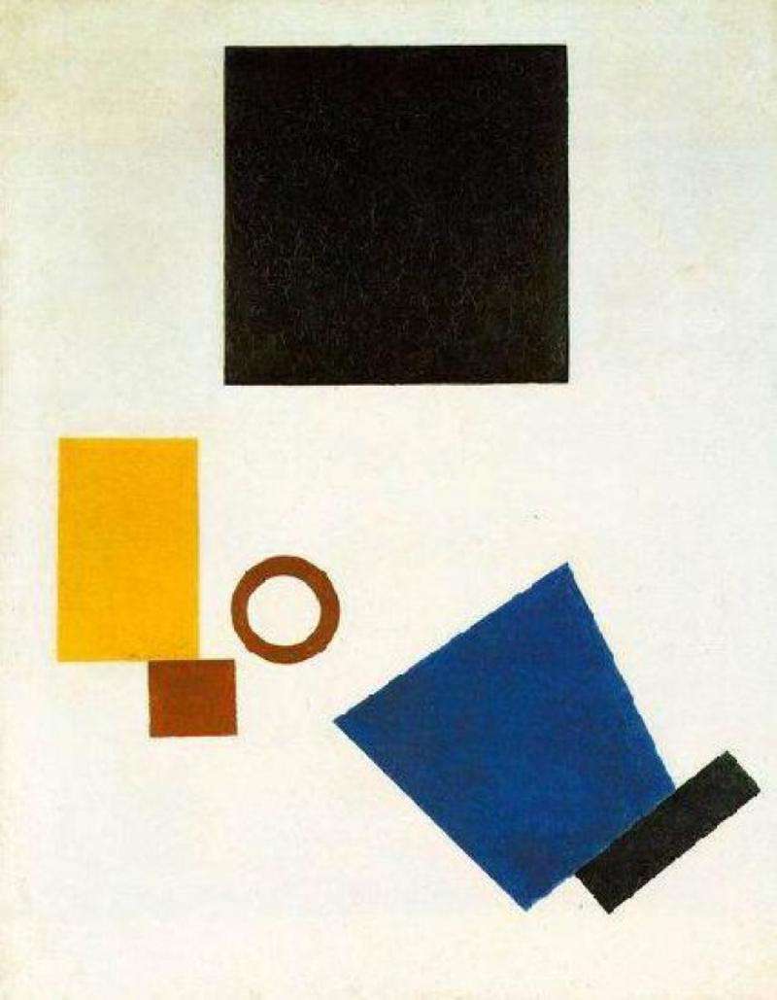
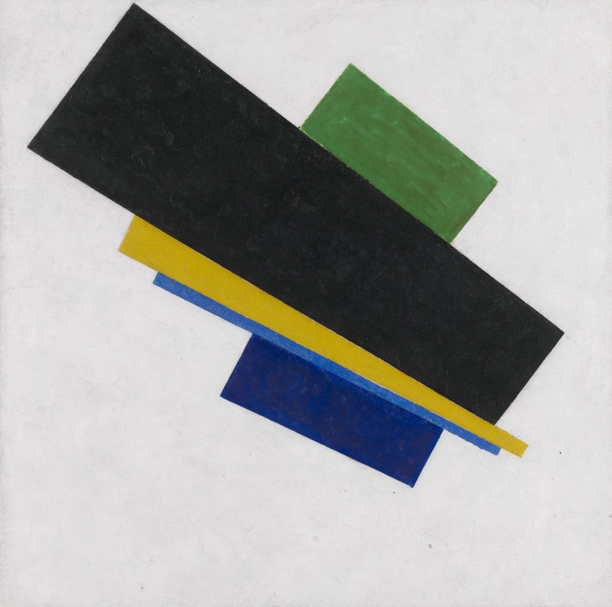

# Задание
Выбрать одну из картин Малевича и сверстать ее с помощью transform.

# Подготовка 
1. Нужно скачать заготовку - файл [`painting.html`](./painting.html)
2. Нужно скачать одну из трех картинок [`easy.jpg`](./easy.jpg), [`medium.jpg`](./medium.jpg), [`hard.jpg`](./hard.jpg)
3. В файле  [`painting.html`](./painting.html) вставить соответсвующий `src` картинкам `palette` и `reference`

# Ограничения
- ВСЕ Объекты должны иметь класс `shape` с предзаданным CSS. 
- Вы можете использовать ТОЛЬКО свойства связанные с `transform`. В том числе для задания размера!

<table>
  <tr>
    <td>Cложность</td>
    <td>Легкий</td>
    <td>Средний</td >
    <td>Сложный</td>
  </tr>
  <tr>
    <td>Картинка</td>
    <td></td>
    <td></td>
    <td></td>
  </tr>
  <tr>
    <td>Нужна перспектива?</td>
    <td>Нет</td>
    <td colspan="2">Да</td>
  <tr/>
  <tr>
    <td>Функции трансформации</td>
    <td>translate, rotateZ, scale</td>
    <td>translate, rotateZ, scale, rotateX/rotateY</td>
    <td>translate, rotateZ, scale, rotateX/rotateY</td>
  </tr>
</table>