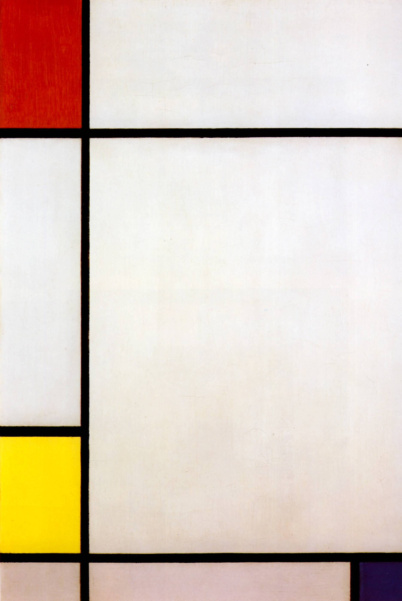
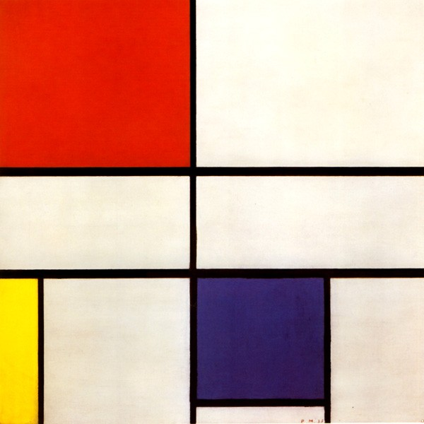
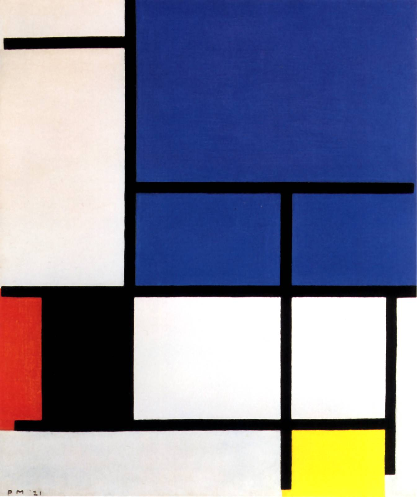

# Задание
Выбрать одну из картин Пита Модриана и сверстать ее с помощью grid.

# Подготовка 
1. Нужно скачать заготовку - файл [`painting.html`](./painting.html)
2. Нужно скачать одну из трех картинок [`easy.jpg`](./easy.jpg), [`medium.jpg`](./medium.jpg), [`hard.jpg`](./hard.jpg)
3. В файле  [`painting.html`](./painting.html) вставить соответсвующий `src` картинкам `palette` и `reference`

# Ограничения
- Позиционирование и определение размеров ТОЛЬКО через свойства ссвязанные с `grid`. 

<table>
  <tr>
    <td>Cложность</td>
    <td>Легкий</td>
    <td>Средний</td >
    <td>Сложный</td>
  </tr>
  <tr>
    <td>Картинка</td>
    <td></td>
    <td></td>
    <td></td>
  </tr>
</table>